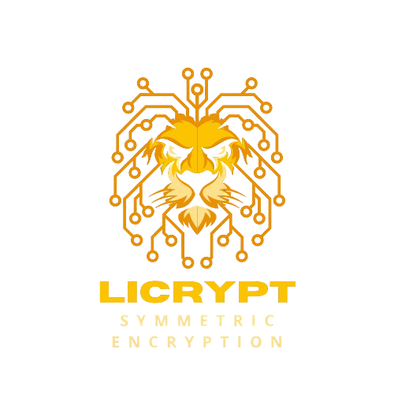

<div align="center">
	
</div>

# Licrypt

- Symmetric encryption made easy
- Securely encrypt and decrypt
- Data authenticity and integrity

#### Install PKG
``go get github.com/SimpaiX-net/licrypt``

#### Current implementations
- AES CTR 
  > In the form of ``hmac|iv|cipher``, HMAC provides authenticity and integrity over ``iv + cipher`` as AES CTR is not solely secure
- AES GCM  - **Endorsed: Highly efficient**
  > The GCM algorithm provides both data authenticity (integrity) and confidentiality therefore no HMAC is required

#### Benchmark

```
❯ go test -benchmem -run=^$ -bench ^BenchmarkAES128GCM$ github.com/SimpaiX-net/licrypt/tests -v
goos: windows
goarch: amd64
pkg: github.com/SimpaiX-net/licrypt/tests
cpu: AMD Ryzen 7 4800H with Radeon Graphics
BenchmarkAES128GCM
BenchmarkAES128GCM-16            2835874               430.9 ns/op           864 B/op          8 allocs/op
PASS
ok      github.com/SimpaiX-net/licrypt/tests    1.802s
```

#### Example
```go
package tests

import (
	"log"

	aesgcm "github.com/SimpaiX-net/licrypt/aes-gcm"
)


func main() {
	crypt, err := (&aesgcm.Crypter{}).Init(
		SECRET,
	)

	if err != nil {
		log.Fatal(err)
	}

	encr, err := crypt.Encrypt([]byte("hallo wereld"))
	if err != nil {
		log.Fatal(err)
	}

	log.Printf("Encrypted: %s\n", encr)

	decr, err := crypt.Decrypt(encr)
	if err != nil {
		log.Fatal(err)
	}

	log.Printf("Decrypted: %s", decr)
}
```

### License
See ``LICENSE`` file